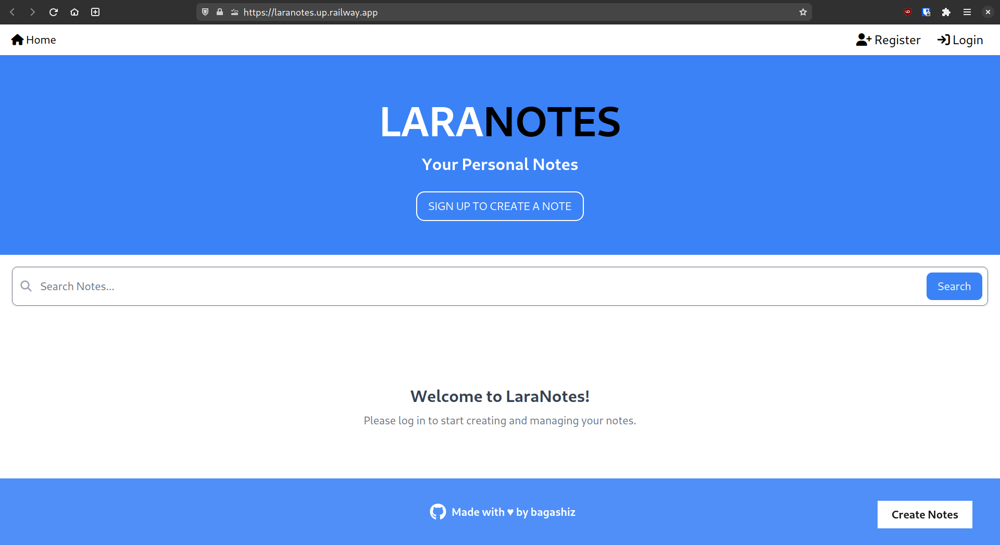
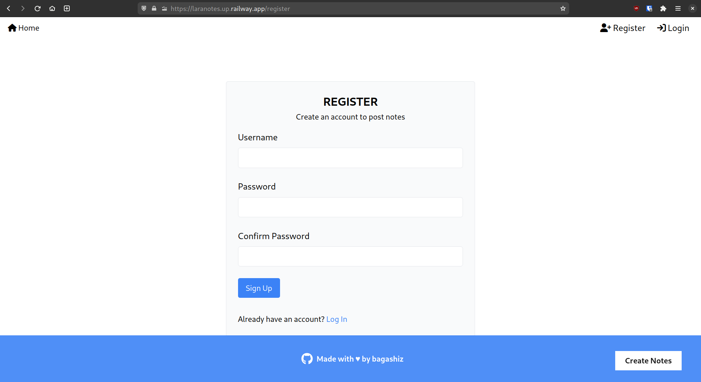
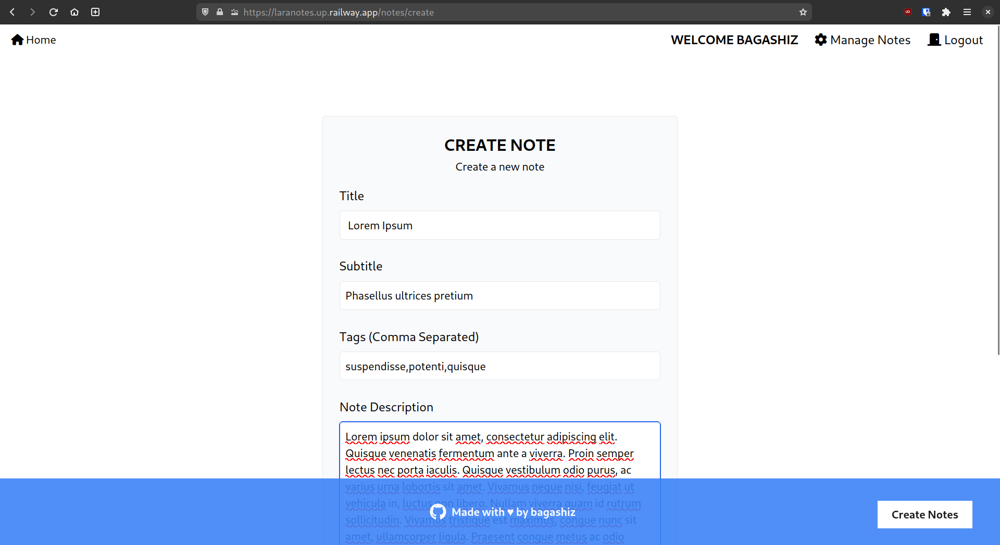
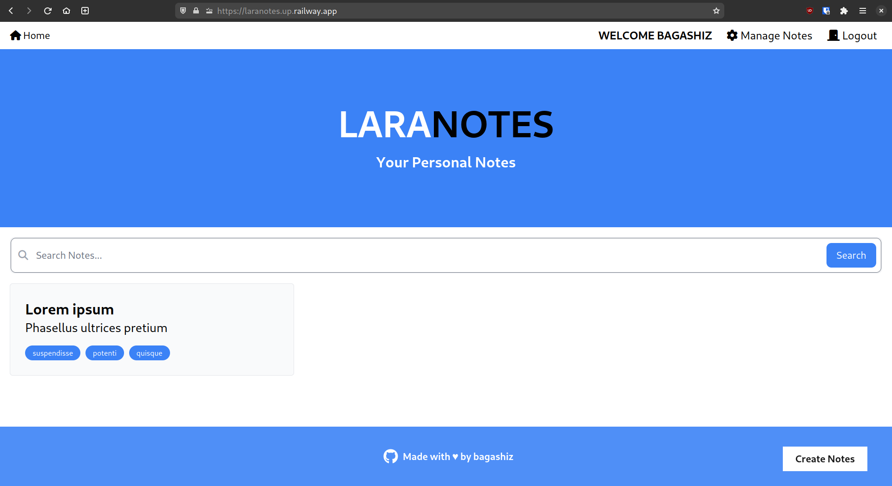
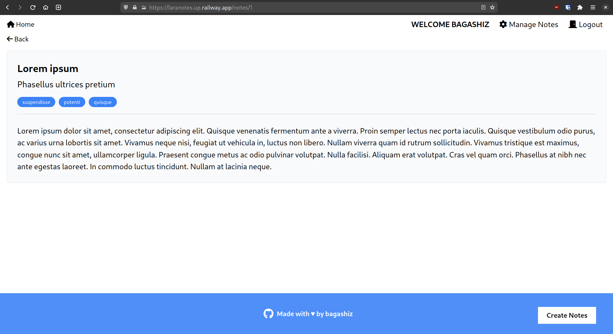
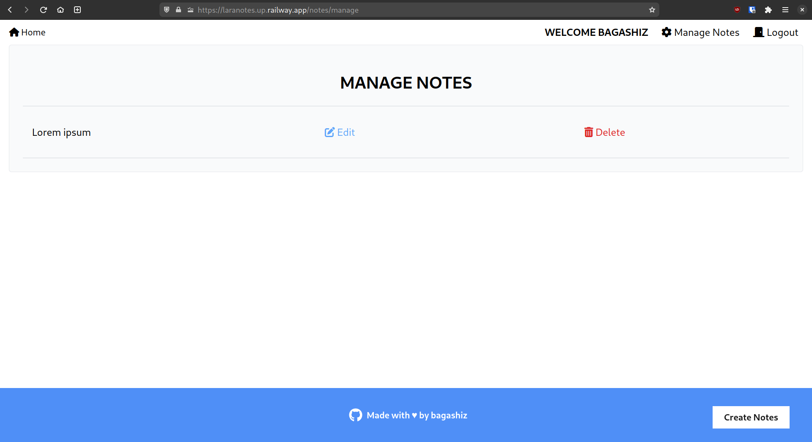

# LaraNotes | Simple Notes Web App

## Introduction

LaraNotes is a simple notes web app built with Laravel 10. It is a simple CRUD application that allows users to create, read, update and delete notes. It also allows users to register and login to the application. It uses a MySQL database to store the notes and users.

This is my first deployed Laravel application. I built it to learn the Laravel framework and to get a feel of how it works. I also used it to learn how to deploy a Laravel application to [Railway](https://railway.app/).

## Screenshots








## Demo

You can view the demo of the application [here](https://laranotes.up.railway.app/).

## Development

### Requirements

- [PHP 8.2](https://www.php.net/downloads.php) or higher
- [Composer](https://getcomposer.org/download/)
- [MySQL 8.0](https://dev.mysql.com/downloads/mysql/)

### Installation

1. Clone the repository and change directory to the project folder.

    ```bash
    git clone https://github.com/bagashiz/laranotes.git
    cd laranotes
    ```

2. Install the dependencies.

    ```bash
    composer install
    ```

3. Set up the database.

    ```bash
    mysql -u root -p{your mysql root password}
    ```

    ```sql
    CREATE DATABASE laranotes;
    ```

    ```sql
    CREATE DATABASE laranotes_testing;
    ```

    ```bash
    exit
    ```

4. Copy the `.env.example` file to `.env` and update the database credentials.

    ```bash
    cp .env.example .env
    ```

5. Generate the application key.

    ```bash
    php artisan key:generate
    ```

6. Run the migrations.

    ```bash
    php artisan migrate:fresh --seed
    ```

7. Start the development server.

    ```bash
    php artisan serve
    ```

8. Open the application in your browser at `http://localhost:8000`.

## Contributing

Pull requests are welcome. Don't forget to properly test and document your code before submitting a pull request. For major changes, please open an issue first to discuss what you would like to change.
